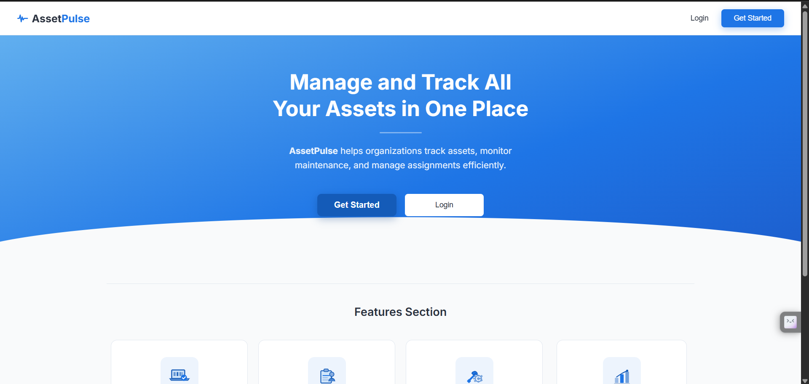
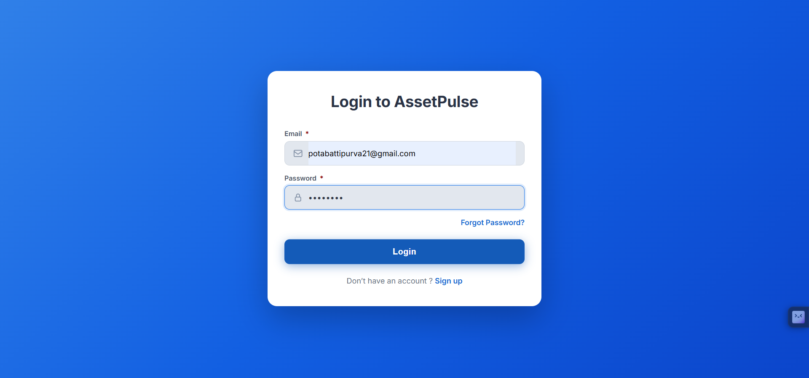
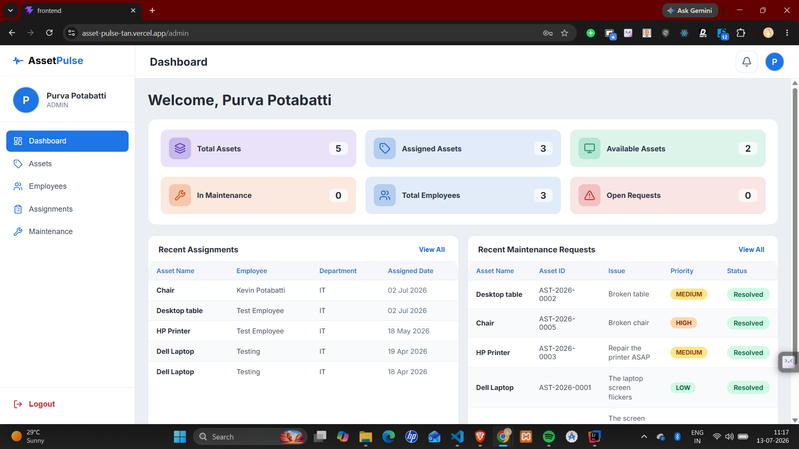
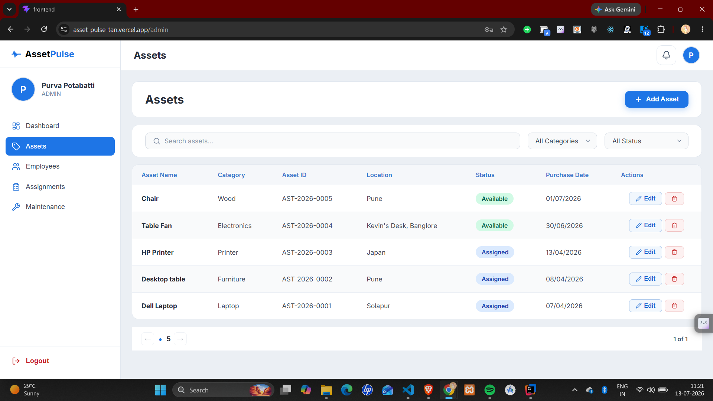
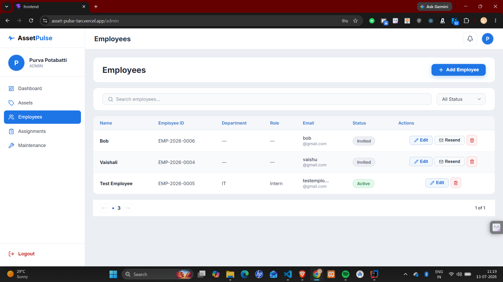
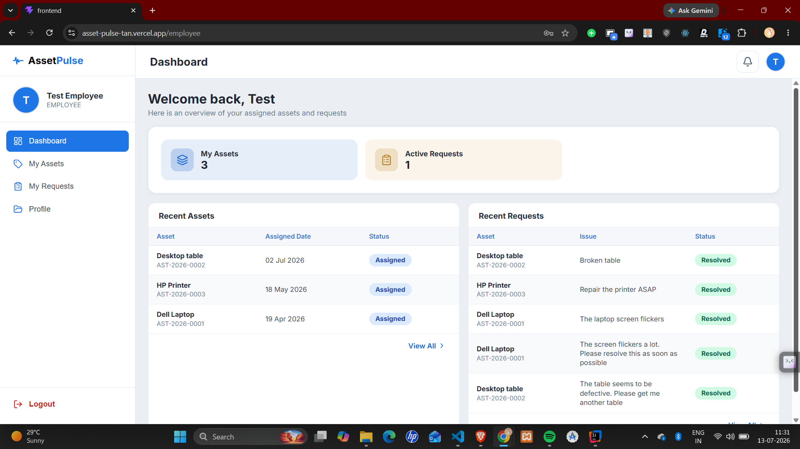
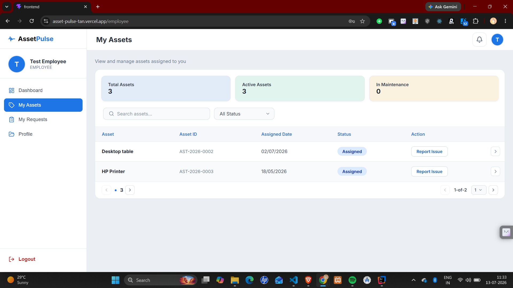
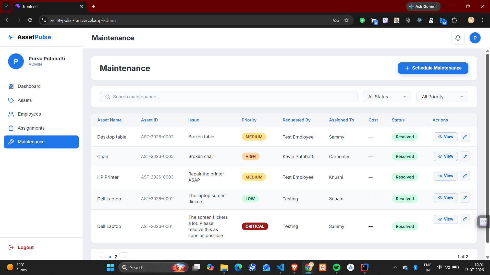
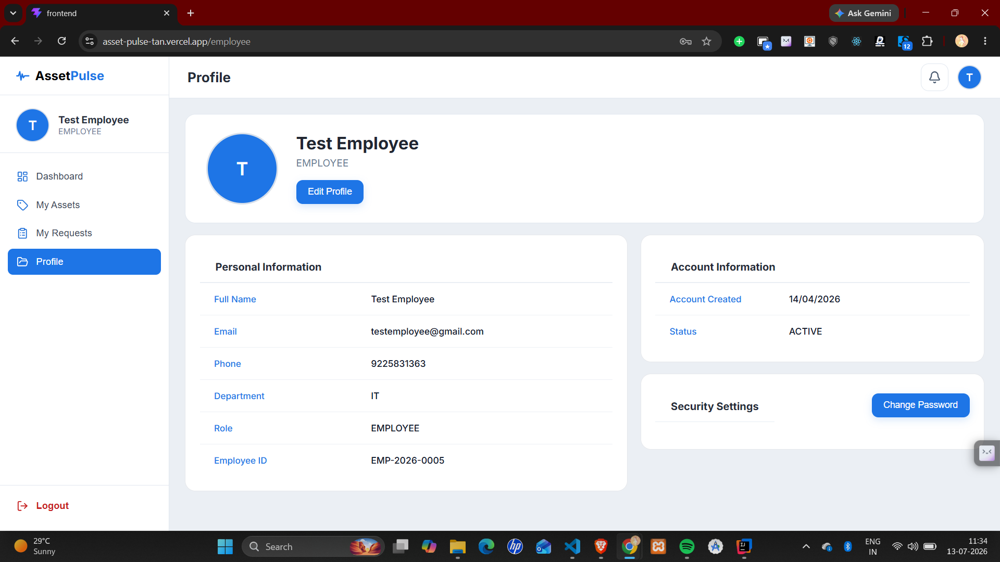

<p align="center">
  
</p>

<h1 align="center">AssetPulse</h1>

<p align="center">
  <strong>A secure role-based Asset Management System built with Spring Boot, React.js, MongoDB Atlas, and JWT Authentication.</strong>
</p>


---

## Project Motivation

Organizations often rely on spreadsheets or manual records to manage assets, making it difficult to track assignments, maintenance requests, and asset availability.

AssetPulse was developed to provide a centralized platform where administrators can efficiently manage organizational assets while employees can easily access assigned assets, raise maintenance requests, and update their profiles through a secure role-based system.


## Live Demo

- Frontend (Vercel): https://asset-pulse.vercel.app
- Backend API (Render): https://assetpulse-backend-omjn.onrender.com


---

## 📖 About

AssetPulse is a full-stack asset management system designed to help organizations efficiently manage assets, employees, assignments, and maintenance requests through a secure role-based platform. It enables administrators to efficiently manage assets, employees, assignments, and maintenance requests while providing employees with a dedicated portal to view assigned assets, raise maintenance requests, and manage their profiles.

The application follows a secure role-based architecture using **Spring Security** and **JWT Authentication**, ensuring that users can only access resources permitted by their assigned roles. A React frontend communicates with the Spring Boot backend through REST APIs, with MongoDB Atlas serving as the database.

---

## ✨ Key Features

### 🔐 Authentication & Security

- JWT-based Authentication
- Role-Based Access Control (Admin & Employee)
- Spring Security Integration
- Secure Password Reset
- First-Time Account Setup
- Protected Routes
- Stateless Authentication

### 👨‍💼 Administrator Module

- Dashboard Overview
- Employee Management
- Asset Management
- Asset Assignment
- Maintenance Request Management
- Notification Management
- Search & Filter Functionality

### 👨‍💻 Employee Module

- Employee Dashboard
- View Assigned Assets
- Raise Maintenance Requests
- Track Request Status
- Update Profile

### 🌐 General Features

- Responsive User Interface
- RESTful API Architecture
- MongoDB Integration
- Clean Dashboard Design
- Toast Notifications


---

## Tech Stack

| Layer | Technology |
|--------|------------|
| Frontend | React.js, Vite |
| Backend | Spring Boot |
| Security | Spring Security, JWT |
| Database | MongoDB Atlas |
| Build Tool | Maven |
| Styling | CSS |
| Deployment | Vercel, Render |

---

## Installation

### Clone Repository

```bash
git clone https://github.com/PurvaPotabatti/AssetPulse.git
```

### Backend

```bash
cd backend
mvn spring-boot:run
```

### Frontend

```bash
cd frontend
npm install
npm run dev
```
---
## Note

Email invitation and password reset functionality are fully implemented and work correctly in the local development environment.

Due to outbound SMTP restrictions on the free deployment platform, email delivery may not function in the live demo.

All other application features are fully operational.

---

## 📸 Screenshots

### Landing Page


### Login




### Admin Dashboard




### Assets Management




### Employees Management




### Employee Dashboard




### Employee Assets




### Maintenance Requests




### Employee Profile

